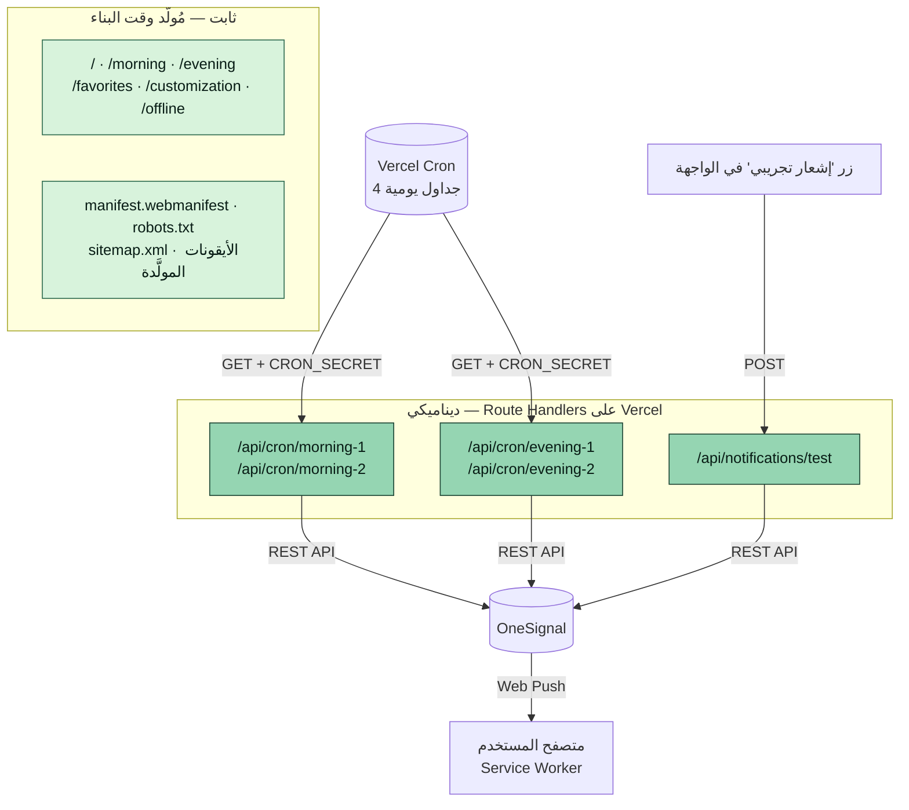
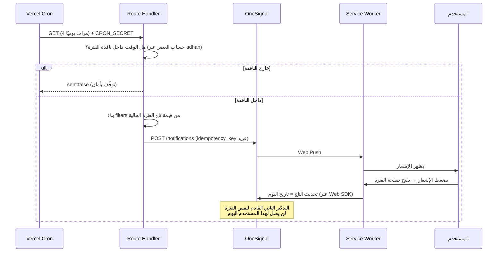

# أذكار الصباح والمساء

تطبيق ويب عربي (PWA) لقراءة ومتابعة أذكار الصباح والمساء، مع عداد تكرار،
مفضّلة، عمل كامل بدون إنترنت، وتذكيرات push فعلية عبر OneSignal.

**رابط الإنتاج**: [azkkar.vercel.app](https://azkkar.vercel.app)

---

## 1. نظرة عامة

المشروع مبني بـ **Next.js 16.3** (App Router) و**TypeScript**، ومصمَّم من
الأساس ليعمل بلا إنترنت (محتوى الأذكار مُضمَّن وقت البناء، لا طلبات شبكة
لعرضه)، مع نظام تذكيرات يومية حقيقي يستخدم Web Push بدون أي قاعدة بيانات —
كل الحالة اللازمة (تفعيل/تعطيل، هل تفاعل المستخدم اليوم) محفوظة في
OneSignal Data Tags فقط.

لا حسابات مستخدمين، لا تتبّع، لا إعلانات — تطبيق مجاني بالكامل.

---

## 2. الصفحات والميزات

| الصفحة | الوصف |
|---|---|
| `/` — الرئيسية | نقطة الدخول، بطاقات توجّه لأذكار الصباح/المساء |
| `/morning` — أذكار الصباح | 28 ذكرًا (قرآن/سنّة)، عداد تكرار لكل ذكر، تقدّم عام للفترة |
| `/evening` — أذكار المساء | 23 ذكرًا، نفس آلية العداد والتقدّم |
| `/favorites` — المفضلة | الأذكار التي حفظها المستخدم من الصفحتين أعلاه |
| `/customization` — التخصيص | حجم الخط، المظهر (فاتح/داكن)، الانتقال التلقائي بين الأذكار، شكل العداد (دائري/متوازن)، **وقسم الإشعارات الكامل** |
| `/offline` | صفحة احتياطية يعرضها Service Worker عند فقد الاتصال وعدم توفر نسخة مخزَّنة |

كل صفحات المحتوى **مُصيَّرة بالكامل من الخادم وقت البناء** (React Server
Components) — النص العربي موجود في HTML الأساسي، لا يعتمد على تحميل
JavaScript جانب العميل ليظهر.

### تخصيصات العرض
- **عدّاد التكرار**: شكلان — دائري (حلقة تقدّم) أو متوازن (رقم في المنتصف) — يُختار من صفحة التخصيص.
- **الانتقال التلقائي**: الانتقال للذكر التالي تلقائيًا بعد اكتمال العدد المطلوب.
- **المظهر**: فاتح/داكن بلوحة ألوان "Fresh Greens" مخصّصة، مع التحقق من تباين WCAG AA.
- **حجم الخط**: 5 مستويات، يتحكم في حجم كل النصوص نسبيًا.

---

## 3. المعمارية التقنية

المشروع **هجين (Hybrid)**: أغلب الصفحات ثابتة تمامًا (Static)، وفقط
مسارات الإشعارات ديناميكية (Route Handlers على الخادم) — التفاصيل الكاملة
وسبب كل قرار موثَّقة في [`ARCHITECTURE.md`](ARCHITECTURE.md).



### الحزمة التقنية
- **Next.js 16.3** (App Router, Turbopack) + **React 19.2** + **TypeScript**
- **Tailwind CSS v4** (بدون ملف config منفصل، عبر `@theme inline`)
- **shadcn/ui** + **Base UI** للمكوّنات الأساسية
- **OneSignal Web SDK v16** للإشعارات (محمَّل من CDN، بدون حزمة npm)
- **adhan** لحساب مواعيد الصلاة محليًا (بدون API خارجي)
- **uuid** لتوليد مفاتيح idempotency حتمية
- استضافة ونشر عبر **Vercel** (Hobby plan)، جدولة عبر **Vercel Cron**

---

## 4. العمل بدون إنترنت (PWA)

Service Worker مكتوب يدويًا بالكامل (`public/OneSignalSDKWorker.js`، بلا
Workbox/Serwist/next-pwa) — تخزين مسبق لهيكل التطبيق، شبكة أولًا لطلبات
التصفّح مع تراجع للتخزين المؤقت ثم لصفحة `/offline`، وتحديثات لا تُطبَّق
تلقائيًا إلا بموافقة المستخدم عبر تنبيه.

---

## 5. نظام الإشعارات (OneSignal)

أربعة تذكيرات يوميًا — إشعاران لأذكار الصباح، إشعاران لأذكار المساء —
بقاعدة عمل أساسية: **لا يصل التذكير الثاني لمن فتح صفحة الفترة بالفعل**.
كل هذا بدون قاعدة بيانات؛ الحالة الوحيدة اللازمة محفوظة في OneSignal Data
Tags. القرار المعماري الكامل، البدائل التي قُورنت، وحدود الخطة المجانية
موثَّقة بالتفصيل في [`NOTIFICATIONS_PLAN.md`](NOTIFICATIONS_PLAN.md).

### كيف يعمل عمليًا



### التصميم الأساسي
- **بدون جدولة داخل OneSignal نفسه** — كل إشعار يُبنى ويُرسَل فورًا وقت
  استدعاء الـCron، بفلتر مبني من الحالة اللحظية، تجنبًا للاعتماد على سلوك
  غير موثَّق لإعادة تقييم الفلاتر في الرسائل المجدولة.
- **تاج واحد مضغوط لكل فترة** (`morning_state` / `evening_state`) يحمل
  إما `"off"` (معطّل) أو تاريخ آخر تفاعل — بسبب حد الـ**2 Data Tags** فقط
  في خطة OneSignal المجانية.
- **موعد العصر** يُحسب يوميًا محليًا عبر مكتبة `adhan` — بدون API خارجي
  وبدون أي حساب يدوي للتوقيت الصيفي.

---

## 6. رحلة البناء: التحديات وكيف حُلّت

النظام اتبنى بالكامل ثم اتّضح فعليًا بعد النشر الحقيقي — عدد من المشاكل
ظهرت فقط بالاختبار الحي على المتصفح، رغم موافقتها للتوثيق الرسمي وقت
الكتابة. كل واحدة منها موثَّقة كـcommit منفصل في السجل، وهنا ملخّصها:

| # | المشكلة | السبب الحقيقي | الحل |
|---|---|---|---|
| 1 | لا يمكن إرسال push بأمان من تطبيق static export | REST API Key سري يحتاج خادمًا وقت التشغيل، وstatic export لا يوفّر واحدًا | إزالة `output: "export"`، تحويل المشروع لهجين (صفحات ثابتة + Route Handlers ديناميكية للإشعارات فقط) |
| 2 | خطة OneSignal المجانية تسمح بتاجين فقط | الخطة الأولية افترضت 4 تاجات (seen×2 + enabled×2) | ترميز مضغوط: تاج واحد لكل فترة يحمل "off" أو تاريخ آخر تفاعل |
| 3 | `/api/cron/*` كانت سترجع 308 redirect و**Vercel Cron لا يتبع الـredirects** | `trailingSlash: true` في إعدادات المشروع | إضافة `/` صريحة لكل مسار في `vercel.json` |
| 4 | زر "تفعيل الإشعارات" يعلّق للأبد بلا استجابة | لا يوجد timeout؛ الكود ينتظر SDK لم يُحمَّل أصلًا (بدون App ID) | فشل فوري برسالة عربية + timeout 8 ثوانٍ لأي تعطّل لاحق (CDN محجوب، إلخ) |
| 5 | `SDK already initialized` في الـconsole | React Strict Mode يستدعي الـeffects مرتين عمدًا في وضع dev | حارس على مستوى الملف (module-level) يمنع نداء `OneSignal.init()` أكثر من مرة |
| 6 | نوع خاطئ لـ`getTags()` في الكود | افتُرض أنها Promise استنادًا لتخمين أوّلي | تأكيد فعلي من الكود المصدري لـSDK: الدالة متزامنة (sync)، وتصحيح كل الاستخدامات |
| 7 | **خطأ 404 حقيقي فى الإنتاج**: `OneSignal.init()` كان يتجاهل `serviceWorkerPath` المخصَّص ويطلب الاسم الافتراضي دومًا | التوثيق الرسمي لـOneSignal أكّد أن الخيار البرمجي كافٍ وحده — **تبيّن خطأ هذا التأكيد عمليًا** | إعادة تسمية الملف لاسم OneSignal الافتراضي (`OneSignalSDKWorker.js`) بدل الاعتماد على إعداد مخصَّص |
| 8 | إشعار تجريبي يفشل بـ502 | استدعاء OneSignal REST API نفسه يفشل من الخادم | إضافة تسجيل لنص خطأ OneSignal الفعلي (وليس الرقم فقط) في الـlogs للتشخيص السريع |
| 9 | **400 Bad Request**: `"Message Notifications must have Any/English language content"` | OneSignal يتطلب مفتاح `en` دائمًا حتى لو التطبيق عربي بالكامل — غير موثَّق في أي صفحة رسمية رُوجعت | تكرار نفس النص العربي تحت مفتاحي `en` و`ar` معًا (لا ترجمة فعلية، فقط لإرضاء التحقّق الإلزامي) |
| 10 | تنبيه "نسخة جديدة متاحة" يتكرر 3 مرات ولا يختفي حتى بعد التحديث | فحص `registration.waiting` كان يعمل عند **كل** تحميل صفحة، فأي عامل عالق في حالة "waiting" يُعاد اكتشافه للأبد | الاعتماد فقط على حدث `updatefound` الحي (يغطي نفس الحالات دون المسار المعطوب)، بالإضافة لمعرّف ثابت للتنبيه لمنع تكدّس نسخ متعددة |

**الدرس الأهم من الرحلة دي**: التوثيق الرسمي (حتى لـخدمة ناضجة زي
OneSignal) أخطأ مرتين في نفس الجلسة (المشكلتان 7 و9) — الاختبار الحي على
الإنتاج الحقيقي كان الطريقة الوحيدة لاكتشاف الحقيقة، مش القراءة وحدها.

```mermaid
graph LR
    A["1: Static export<br/>يمنع الإرسال الآمن"] --> B["2: حد التاجات<br/>في الخطة المجانية"]
    B --> C["3: مشكلة<br/>trailing slash"]
    C --> D["4: تعليق لا نهائي<br/>بلا timeout"]
    D --> E["5: Strict Mode<br/>double-init"]
    E --> F["6: getTags خطأ<br/>sync/async"]
    F --> G["7: 404 حقيقي<br/>اسم Service Worker"]
    G --> H["8: 502 بلا<br/>تفاصيل خطأ"]
    H --> I["9: 400 مفتاح<br/>en المفقود"]
    I --> J["10: تنبيه<br/>لا يختفي"]
    J --> K(["✅ يعمل بالكامل"])

    style K fill:#52b788,stroke:#081c15,color:#081c15
```



---

## 7. التشغيل محليًا

```bash
npm install
npm run dev
```

بيانات الأذكار مصدرها الوحيد `data/azkar.json`، تُقرأ عبر `data/azkar.ts`
(`getMorningAzkar`، `getEveningAzkar`، `getAzkarByPeriod`، `getDhikrById`)
وتُستورَد وقت البناء عبر `resolveJsonModule` — لا طلب شبكة وقت التشغيل.

### متغيرات البيئة

انسخ `.env.example` إلى `.env.local` واملأ القيم (التفاصيل الكاملة في
[`NOTIFICATIONS_PLAN.md`](NOTIFICATIONS_PLAN.md) قسم 14):

| المتغيّر | نوعه | من أين |
|---|---|---|
| `NEXT_PUBLIC_ONESIGNAL_APP_ID` | عام | OneSignal Dashboard → Settings → Keys & IDs |
| `ONESIGNAL_REST_API_KEY` | **سري** | نفس الصفحة — يظهر مرة واحدة فقط وقت الإنشاء |
| `CRON_SECRET` | **سري** | تولّده بنفسك (نص عشوائي طويل) |

> ⚠️ اختبار الإشعارات محليًا على `localhost` غير ممكن إلا بـApp منفصل على
> OneSignal مخصَّص لذلك — الـApp الأساسي مقفول على `https://azkkar.vercel.app`
> فقط. الاختبار الحقيقي يتم على الرابط المنشور.

---

## 8. النشر (Deployment)

الاستضافة على **Vercel**، مع أربع مهام **Cron** معرَّفة في `vercel.json`
(مواعيد UTC ثابتة بهامش أمان يغطي احتمالي أوفست القاهرة +2/+3 — التفاصيل
في `NOTIFICATIONS_PLAN.md` قسم 12). لازم إضافة الثلاثة متغيرات أعلاه في
**Vercel → Project Settings → Environment Variables** قبل أي نشر يعتمد
على الإشعارات.

---

## 9. توثيق إضافي

- [`ARCHITECTURE.md`](ARCHITECTURE.md) — القرارات المعمارية الكاملة (العرض، PWA، التخزين المحلي، الألوان، شجرة المجلدات).
- [`NOTIFICATIONS_PLAN.md`](NOTIFICATIONS_PLAN.md) — الخطة الكاملة لنظام الإشعارات: مقارنة الحلول، تصميم Tags، الأمان، خطة الاختبار، وحدود الخطط المجانية بمصادرها الرسمية.
